# Getting Started

This project is a starting point for running a software estate on agents
rather than staff. It is a **protocol first** — the specification is the
product, and the server in `server/` is one implementation of it.

If this is your first time here, read in this order:

1. **[SPEC.md](SPEC.md)** — the seven rules, the data model, the thirty-one
   tools. Everything else is downstream of this file.
2. **[SECURITY.md](SECURITY.md)** — what the registry deliberately does not
   protect. Read it before you point it at anything real.
3. **[ANONYMITY.md](ANONYMITY.md)** — only if you intend to publish from a
   live record. It explains the leak guard and what it cannot do.

```mermaid
flowchart LR
    subgraph M10 ["⏱️ first ten minutes"]
        direction LR
        C1["clone + <code>.env</code><br/><small>openssl rand -hex 32</small>"] --> C2["<code>docker compose up -d</code>"] --> C3["declare <code>ecom</code><br/>in any MCP client"] --> C4["the four first calls<br/><small>system_status → create_project<br/>→ register_agent → register_signal_source</small>"]
    end
    subgraph W1 ["📆 first week"]
        direction LR
        D1["one line in the<br/>system prompt"] --> D2["agents read at the start,<br/>write at the end"] --> D3["the record starts<br/>answering questions"]
    end
    M10 --> W1

    style M10 fill:#dbeafe,stroke:#2563eb,stroke-width:2px,color:#0f172a
    style W1 fill:#d1fae5,stroke:#059669,stroke-width:2px,color:#0f172a
    style C1 fill:#f8fafc,stroke:#2563eb,color:#0f172a
    style C2 fill:#f8fafc,stroke:#2563eb,color:#0f172a
    style C3 fill:#f8fafc,stroke:#2563eb,color:#0f172a
    style C4 fill:#f8fafc,stroke:#2563eb,color:#0f172a
    style D1 fill:#f8fafc,stroke:#059669,color:#0f172a
    style D2 fill:#f8fafc,stroke:#059669,color:#0f172a
    style D3 fill:#f8fafc,stroke:#059669,color:#0f172a
```



## Your first ten minutes

```bash
git clone https://github.com/<owner>/agent-estate
cd agent-estate
cp .env.example .env                 # set ECOM_API_TOKEN: openssl rand -hex 32
docker compose up -d
```

Declare the registry once in any MCP client:

```json
{
  "mcpServers": {
    "ecom": {
      "type": "http",
      "url": "https://<your-host>/ecom/mcp/",
      "headers": { "Authorization": "Bearer <your token>" }
    }
  }
}
```

Then have your agent make these four calls, in this order:

```
system_status
create_project          name="…" type="mobile_app|web_app|website|internal_tool|ai_factory"
register_agent          name="…" role="…" model="…" capabilities=[…]
register_signal_source  project="…" kind="crashlytics|analytics|store_reviews|backend_logs|manual"
```

## Your first week

The registry earns its keep only if agents actually write to it. One
instruction in your agent's system prompt is the whole operating discipline:

> Consult the record at the start of a session and add to it at the end.
> Record what you observed as a signal, what you concluded as a finding with
> its evidence, and what you attempted as a task result — including the
> attempts that failed.

Everything after that is a consequence:

| You want to know | Call |
|---|---|
| What is the state of everything? | `system_status` |
| What may start right now? | `ready_tasks` |
| What is worst? | `list_findings` (ranked severity, then confidence) |
| Why is this task stuck? | `task_blockers` |
| What did we try before? | `get_task` — full retry history |
| Where did that claim come from? | `get_finding` — evidence signal ids |

## Publishing from the record

`tools/publish.py` turns a live registry into a public page without a
language model in the loop, and refuses to write anything that trips the
structural leak guard in `tools/redact.py`:

```bash
python3 tools/publish.py --db "$ECOM_DB_PATH" --out docs/index.html
python3 tools/publish.py --db "$ECOM_DB_PATH" --check      # would it change?
python3 tools/publish.py --db "$ECOM_DB_PATH" --push --key ~/.ssh/deploy_key
```

Run it on a timer; it is idempotent and silent when nothing changed.

```cron
*/15 * * * * cd /opt/agent-estate && python3 tools/publish.py \
  --db "$ECOM_DB_PATH" --out docs/index.html --push \
  --key /etc/agent-estate/deploy_key \
  --denylist /etc/agent-estate/denylist.txt >> /var/log/agent-estate.log 2>&1
```

Two files belong outside the repository, both mode `600`:

- **the deploy key**, with write access to this repository only — never
  account-wide, and never in the environment of anything that runs
  agent-authored code;
- **`denylist.txt`**, one estate-specific string per line: real project
  names, hostnames, domains. Committing that list would itself be the
  disclosure, which is why the guard's built-in patterns are structural.

Set `ECOM_PSEUDONYM_SALT` once and leave it alone — the salt is what makes
`holding-A` mean the same holding next week. Changing it reshuffles every
label on the page.

## A few resources

- **[The specification](SPEC.md)** — conformance list at the end; write your
  own registry against it and the rest of this repository becomes optional.
- **[The threat model](SECURITY.md)** — one token, one estate, no roles, and
  everything stored in plain text. All three are deliberate.
- **[Anonymity notes](ANONYMITY.md)** — publishing from a live record without
  publishing the estate.
- **[Model Context Protocol](https://modelcontextprotocol.io)** — the
  transport this speaks. Any MCP client works; none is special-cased.

## Where to ask

Open an issue. There is no chat, no mailing list and no vendor. Issues
reporting that a rule is enforceable only in documentation — rather than in
the store — are the most valuable kind.

Do not paste hostnames, tokens, database dumps or anything identifying an
estate into an issue. Redact first; git history is forever.
