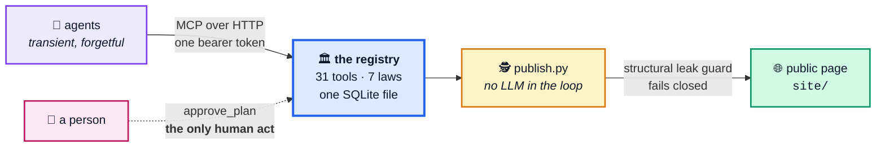

<div align="center">

# Agent EstateMCP

**A registry an autonomous agent writes to, so that an estate of software can be run without human workers.**

Protocol name `ecom` · MCP over HTTP · one SQLite file · MIT

[](SPEC.md)
[](https://modelcontextprotocol.io)
[](SPEC.md#3-data-model)
[](SPEC.md#4-tool-surface)
[](SPEC.md#2-the-seven-laws)
[](SPEC.md#2-the-seven-laws)
[](LICENSE)

[Getting started](GETTING-STARTED.md) · [Specification](SPEC.md) · [Threat model](SECURITY.md) · [Anonymity](ANONYMITY.md)

</div>

---

Agents forget everything between sessions. They are replaced by better models
every few months. They will tell you a thing was done unless the record makes
that inconvenient.

Agent Estate is the counterweight: a small registry that remembers what was
**observed**, what was **concluded**, what was **attempted**, what it **cost**,
and who **decided** — and enforces the honesty rules in the store rather than
in a prompt an agent may never read.

It does not schedule work. It does not run work. It holds no secrets. It
authorises nothing. It records — and exactly one act in the whole system
belongs to a person: `approve_plan`.



## Five chambers, thirty-one tools

| Chamber | Holds | Tools |
|---|---|---|
| **Estates** | what exists — repo, backend, last commit, append-only environment notes | 6 |
| **Agents** | who is at work — role, model, capabilities, heartbeat | 4 |
| **Tasks** | what is being attempted — plan, human gate, DAG of blockers, full retry history | 10 |
| **Signals** | what was observed, unjudged — deduplicated at write time | 4 |
| **Findings** | what was concluded — severity, confidence, evidence, a decision with a reason | 5 |
| *the estate* | `system_status`, `create_backup` | 2 |

The chain is the point: an observation becomes a **signal**; a signal becomes
evidence for a **finding**; an accepted finding becomes a **task**; the task is
planned, gated by a person, and appends a **result** that never erases the
attempt before it.

```mermaid
flowchart LR
    O(["👁️ observation<br/><i>measured</i>"]) --> SG["📡 <b>signal</b><br/>dedupe_key<br/><small>law I</small>"]
    SG --> F["🔬 <b>finding</b><br/>severity × confidence<br/><small>law V</small>"]
    F --> AC{{"⚖️ decide_finding<br/><i>accepted?</i><br/><small>law VI</small>"}}
    AC --> T["🛠️ <b>task</b><br/>DAG of blockers<br/><small>law IV</small>"]
    T --> G["🧑 approve_plan<br/><b>the human gate</b><br/><small>law III</small>"]
    G --> RS["🧾 <b>result</b><br/>appended, never replaced<br/><small>law II</small>"]
    SG -.->|evidence_signal_ids| F
    RS -.->|becomes the next observation| O

    style O fill:#e2e8f0,stroke:#475569,stroke-width:2px,color:#0f172a
    style SG fill:#d1fae5,stroke:#059669,stroke-width:2px,color:#0f172a
    style F fill:#fee2e2,stroke:#dc2626,stroke-width:2px,color:#0f172a
    style AC fill:#fee2e2,stroke:#dc2626,stroke-width:2px,color:#0f172a
    style T fill:#fef3c7,stroke:#d97706,stroke-width:2px,color:#0f172a
    style G fill:#fce7f3,stroke:#be185d,stroke-width:3px,color:#0f172a
    style RS fill:#dbeafe,stroke:#2563eb,stroke-width:2px,color:#0f172a
```



Read [SPEC.md](SPEC.md) — the specification is the project. The server here is
one implementation of it.

## Getting started

This project is a starting point for running a software estate on agents
rather than staff — a **specification** with one reference implementation
attached, not a framework.

A few resources if this is your first time here:

- [Getting started](GETTING-STARTED.md) — first ten minutes, first week
- [The specification](SPEC.md) — seven rules, data model, thirty-one tools
- [Threat model](SECURITY.md) — what this deliberately does not protect
- [Anonymity notes](ANONYMITY.md) — publishing from a live record safely

For help with the transport, see the [Model Context Protocol
documentation](https://modelcontextprotocol.io), which covers clients,
servers and the tool-call shape this speaks.

## Quick start

```bash
git clone https://github.com/<owner>/agent-estate
cd agent-estate
cp .env.example .env          # set ECOM_API_TOKEN to 64 hex characters you generate
docker compose up -d
```

Then declare it once in any MCP client:

```json
{
  "mcpServers": {
    "ecom": {
      "type": "http",
      "url": "https://<your-host>/ecom/mcp/",
      "headers": { "Authorization": "Bearer <your token>" }
    }
  }
}
```

The customary first four calls:

```
system_status
create_project          name="…" type="mobile_app|web_app|website|internal_tool|ai_factory"
register_agent          name="…" role="…" model="…" capabilities=[…]
register_signal_source  project="…" kind="crashlytics|analytics|store_reviews|backend_logs|manual"
```

Then instruct your agents to consult the record at the start of a session and
add to it at the end. That instruction is the entire operating discipline.
There is no other configuration.

## Publishing the record

`tools/publish.py` turns a live registry into a public page — the one at
[`site/`](site/) — and pushes it to a git remote.

It runs **without a language model**. It reads the database, applies the
anonymising projection in `tools/redact.py`, renders numbers into
`site/template.html`, and commits only if the projection actually changed.
An LLM is optional and off by default; it is used, if at all, to rewrite prose
sections — never to decide what may be published.

```bash
python3 tools/publish.py --db /var/lib/ecom/registry.sqlite --out docs/index.html
python3 tools/publish.py --db … --push          # commit + push via deploy key
python3 tools/publish.py --db … --check         # projection diff only, no writes
```

Before writing anything, the publisher runs a **structural leak guard**: any
e-mail address, IPv4, bearer-looking token, private-key header, absolute home
path or non-allowlisted domain in the output aborts the run. The guard fails
closed. See [`ANONYMITY.md`](ANONYMITY.md).

Schedule it on a timer; it is idempotent and silent when nothing changed.

```cron
*/15 * * * * cd /opt/agent-estate && python3 tools/publish.py --db "$ECOM_DB_PATH" --push >> /var/log/agent-estate-publish.log 2>&1
```

## What it is not

- **Not a scheduler.** It records work; something else runs it.
- **Not a secret store.** Everything written is plain text, by design (law VII).
- **Not multi-tenant.** One token, one estate, no roles.
- **Not a replacement for the human gate.** The gate is the product.
- **Not a metrics platform.** It holds the observations you chose to keep.
- **Not a service.** Nobody hosts this for you.

## Contributing

Fork it, run it, break it. Issues that report a law being enforceable only in
documentation — rather than in the store — are the most valuable kind.

Do not open issues containing hostnames, tokens, database dumps or anything
identifying an estate. Redact before you paste; the maintainers cannot unsee it
and neither can the git history.

MIT. No entity behind this, and none implied.
