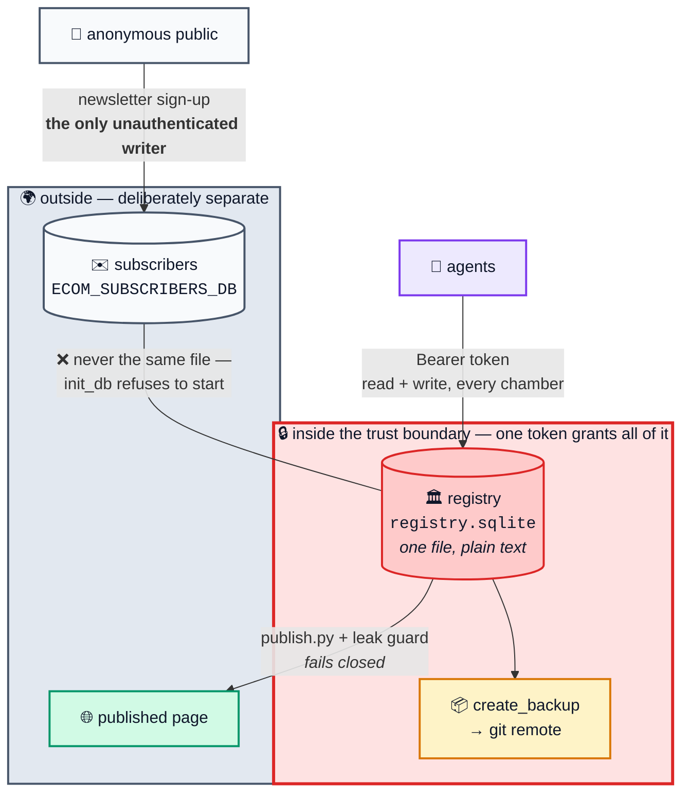

# Threat model

Stated by the authors rather than discovered by you. Everything below is a
known, deliberate limit of v1. If one of these is unacceptable for your estate,
do not deploy this — or fix it and send the patch.

## What the registry assumes

- **One token, one estate, no roles.** The bearer token in
  `Authorization: Bearer …` grants read and write over every chamber. There is
  no per-agent identity, no scope, no audit of *who* called — only of *what*
  was recorded. An agent that can read your MCP client configuration can do
  anything the registry can do.
- **Everything stored is plain text.** `env_notes` and signal-source `config`
  are documented as plain text in the tool descriptions themselves. There is no
  encryption at rest beyond the filesystem's.
- **The database is one file.** Whoever can read it has the whole record;
  whoever can write it can rewrite history despite the append-only laws, which
  are enforced at the tool boundary, not by cryptographic chaining.
- **Backups leave the machine.** `create_backup` pushes a snapshot to the git
  remote you configure. That remote then holds the entire estate record. If it
  is a public repository, so is your record.

## What must never enter the record

Credentials, API keys, tokens, private keys, passwords, connection strings with
passwords, session cookies, personal e-mail addresses, customer data.

Law VII exists because agents are eager and helpful: asked to note how the
backend is reached, an agent will happily paste the whole connection string.
The countermeasure is the tool description, the leak guard in
`tools/redact.py`, and review — in that order of reliability, which is to say:
weak, medium, strong.

## The public sign-up endpoint

The newsletter endpoint is the only unauthenticated writer in the system, so
it is kept out of the registry entirely (`ECOM_SUBSCRIBERS_DB`, a separate
file). Three reasons, in descending order of severity:

1. **Backups.** `create_backup` pushes the registry to a git remote.
   Addresses in that file would be published with every snapshot and would
   remain in git history afterwards.
2. **Write contention.** SQLite has a single writer. A flood against a public
   endpoint sharing the registry file can block an agent's `log_result`.
3. **Input provenance.** The tool surface is meant to be the only way into
   the record. A public form writing to the same file makes that untrue, and
   anything an anonymous caller stores there reaches an agent's context the
   day someone writes a tool that reads it.

`init_db()` refuses to start if the two paths resolve to the same file.

## Rotation

Rotating `ECOM_API_TOKEN` severs every connected agent mid-session, and an
agent that loses the registry cannot record what it did. Correct order:

1. Write the new token into the server environment.
2. Restart the server.
3. Update the MCP client configuration.
4. Have the agent re-read `system_status` before continuing.

Do it at the end of a session, never the middle. This constraint is itself
worth recording as a task in your own estate.

## Deploy keys

`tools/publish.py` pushes with an SSH deploy key. Give that key **write access
to one repository only**, never account-wide access. It should live outside the
repository, mode `600`, and never in the process environment of anything an
agent can run arbitrary code in.

## Publishing

The publisher's leak guard is structural: it rejects e-mail addresses, IPv4
literals, bearer-shaped strings, private-key headers, absolute home paths and
domains outside an allowlist. It does **not** know your company's name, your
project names or your hostnames — a denylist containing those would itself be a
disclosure if committed. Keep such a list outside the repository and pass it
with `--denylist`.

The guard fails closed: on any match, nothing is written and nothing is pushed.

## Reporting

Open a public issue. There is no private channel, no bounty and no entity to
receive a disclosure. Do not include hostnames, tokens or record dumps —
describe the class of the flaw and how to reproduce it against a fresh install.
